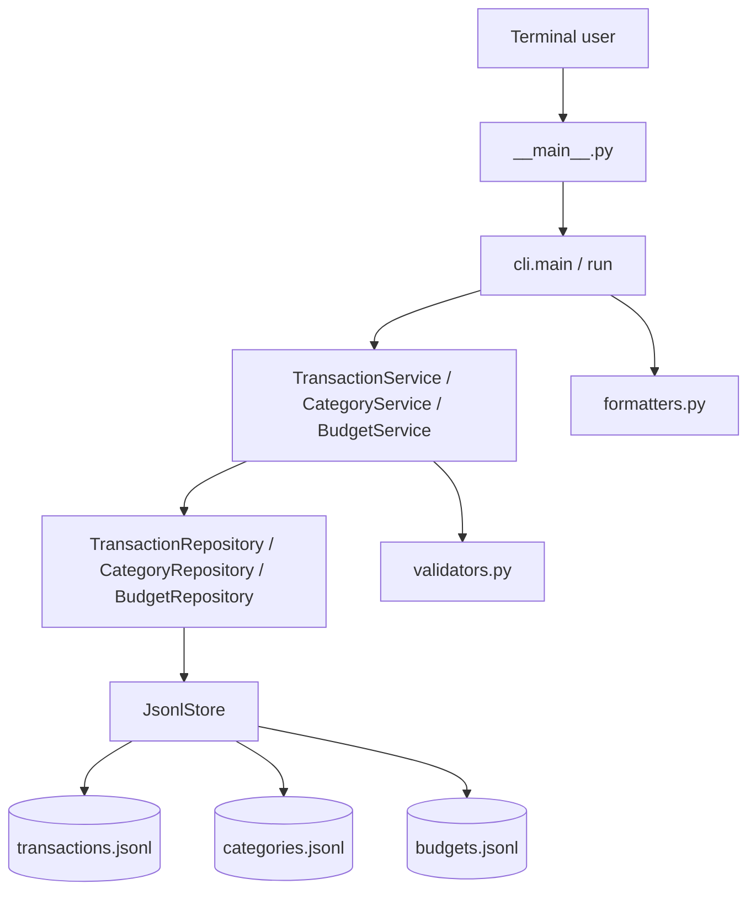
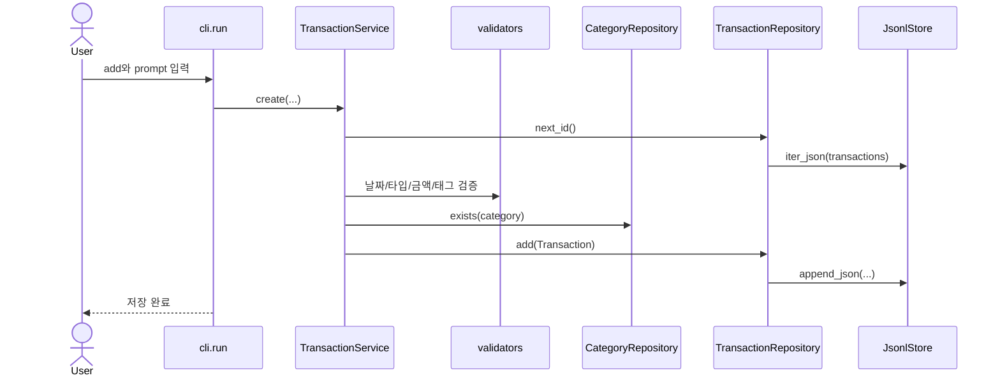
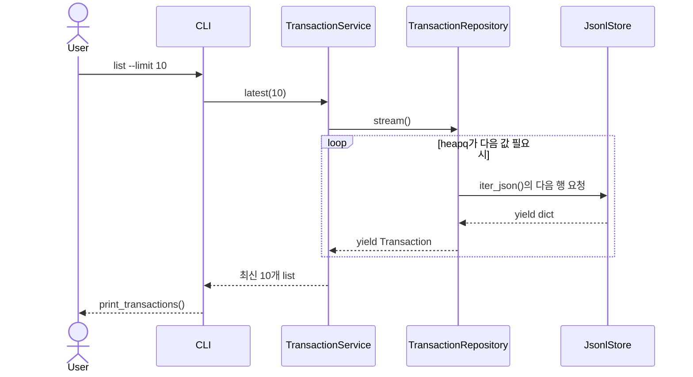
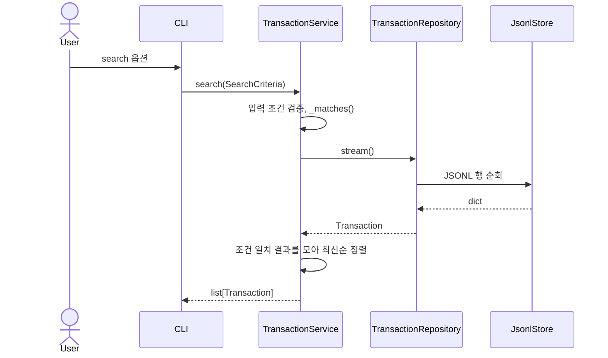
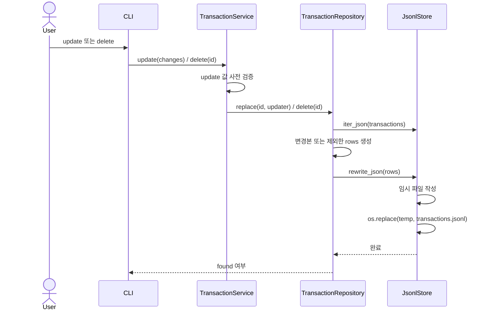
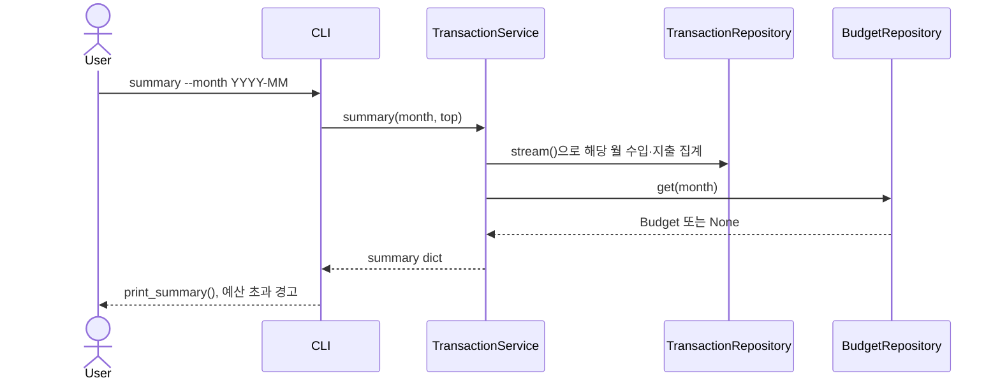
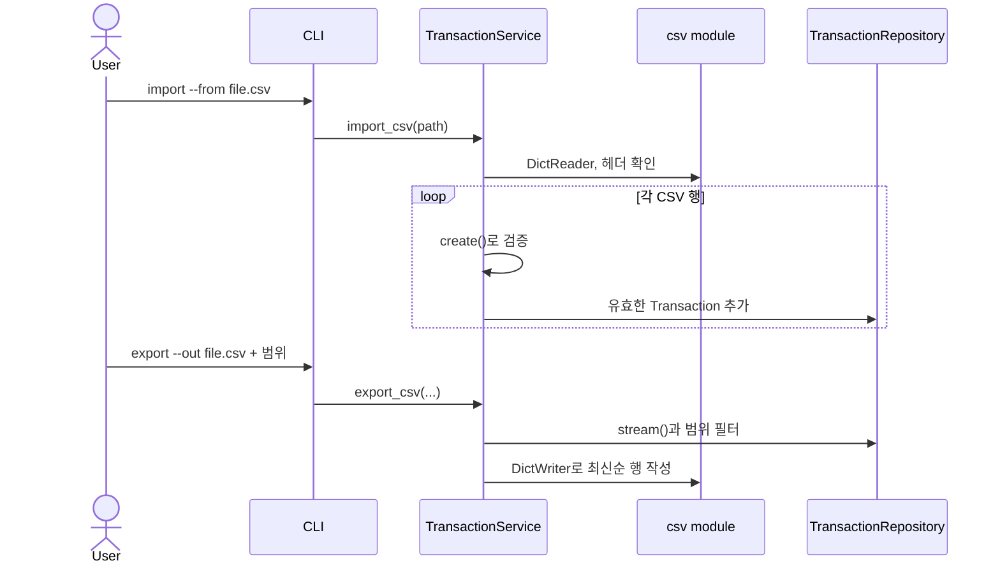
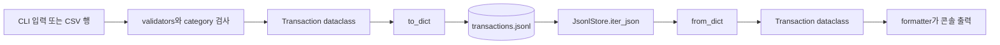

# 코드 아키텍처 읽기 가이드

## 전체 구조



## 파일 구조

```text
budget_app/
├── __main__.py       # python -m budget_app 진입점
├── cli.py            # argparse, 명령 dispatch, 종료 코드
├── models.py         # Transaction, Budget, SearchCriteria dataclass
├── services.py       # 검증 조합과 업무 규칙
├── repositories.py   # JSONL 파일 접근과 repository
├── validators.py     # 날짜·금액·타입·태그 검증
├── decorators.py     # run 실행 시간 logging decorator
├── formatters.py     # 목록·요약 콘솔 출력
├── errors.py         # 사용자용 AppError
├── __init__.py       # 패키지 표시 파일
└── CODE_GUIDE.md     # 기존 코드 설명 문서
```

## `list`로 보는 시작 과정

`python -m budget_app list --limit 10`의 흐름은 다음과 같다.

```text
__main__.py → cli.main() → @log_timing이 감싼 run()
→ build_parser() / parse_args() → build_services()
→ JsonlStore.initialize() → TransactionService.latest(10)
→ TransactionRepository.stream() → JsonlStore.iter_json()
→ Transaction.from_dict() → heapq.nlargest()
→ formatters.print_transactions()
```

`__main__.py`는 `main()`을 호출한다. `run()`은 parser가 만든 `args.command`에 따라 service를 선택하고, `main()`은 `AppError`/`OSError`를 사용자 메시지와 종료 코드 1로 바꾼다.

## 주요 명령 시퀀스

### add



### list (generator)



### search



필터 판정은 repository가 아니라 `TransactionService._matches()`에서 한다.

### update / delete



### summary



### import / export



## Generator 실행 추적

대상은 `TransactionRepository.stream()`과 그 아래 `JsonlStore.iter_json()`이다.

1. `latest()`가 `self.transactions.stream()`을 호출하면 generator 객체가 만들어진다.
2. `heapq.nlargest()`가 다음 거래를 필요로 할 때 generator에 `next()`를 요청한다.
3. `stream()`은 내부 `iter_json()`을 진행시킨다. `iter_json()`은 파일을 열고 다음 비어 있지 않은 줄을 읽어 JSON dict로 파싱한다.
4. `iter_json()`의 `yield data`가 dict를 `stream()`에 넘기고 잠시 멈춘다.
5. `stream()`은 `Transaction.from_dict(row)`를 만들고 `yield`로 호출자에게 넘긴다.
6. 다음 `next()`가 오면 두 generator 모두 이전 yield 다음 줄에서 재개한다. 파일 끝까지 가면 반복이 끝난다.

## Decorator 실행 추적

`cli.py`에서 함수 정의 시 `@log_timing`은 `run = log_timing(run)`을 수행한다. `log_timing()`은 `wrapper`를 반환하며 `@functools.wraps(func)`로 원본 `run`의 이름과 문서를 유지한다.

실행 시 `main()`의 `run()` 호출은 wrapper 호출이다. wrapper는 `time.perf_counter()`로 시작 시간을 저장하고 원본 run을 실행하며, `finally`에서 성공·실패와 무관하게 `budget_app` logger에 함수명과 밀리초를 기록한 후 원래 반환값 또는 예외 흐름을 유지한다.

## Transaction 데이터 생명주기



`to_dict()`는 JSONL에 쓸 기본 자료형 dict를 만들고, `from_dict()`는 JSONL에서 읽은 dict를 `Transaction`으로 복원한다. `tags`가 문자열로 읽힌 경우에도 `from_dict()`가 쉼표 기준 리스트로 정규화한다.

## 권장 코드 읽기 순서

### 1. `__main__.py`

볼 것: 패키지 실행이 `cli.main()`으로 들어가는 지점. 질문: `python -m budget_app`이 어떤 import를 거쳐 시작되는가?

### 2. `cli.py`

볼 것: `build_parser()`, `build_services()`, `run()`, `main()`. 질문: 어떤 option이 argparse에서 정의되고, 오류는 어디서 종료 코드로 바뀌는가?

### 3. `models.py`

볼 것: 세 dataclass와 `Transaction.to_dict()/from_dict()`. 질문: 파일 dict와 도메인 객체를 왜 변환하는가? `frozen=True`일 때 update는 어떻게 가능한가?

### 4. `services.py`

볼 것: `create`, `latest`, `search`, `update`, `summary`, `import_csv`, `export_csv`. 질문: CLI가 파일을 직접 열지 않는 이유는 무엇인가? 검색 결과는 어느 시점에 리스트가 되는가?

### 5. `repositories.py`

볼 것: `iter_json`, `stream`, `rewrite_json`, `replace`, `delete`. 질문: 어느 함수가 실제 `yield`를 하는가? 원본 파일을 직접 덮지 않는 이유는 무엇인가?

### 6. `validators.py`, `errors.py`

볼 것: `parse_*`와 `AppError`. 질문: `ValueError`를 왜 사용자용 오류로 바꾸는가? category 검증은 왜 validators가 아닌 service에 있는가?

### 7. `decorators.py`, `formatters.py`

볼 것: `log_timing`과 출력 함수. 질문: timing을 decorator로 분리해 얻는 이점은 무엇인가? 예산 초과 경고는 어디서 계산되는가?
