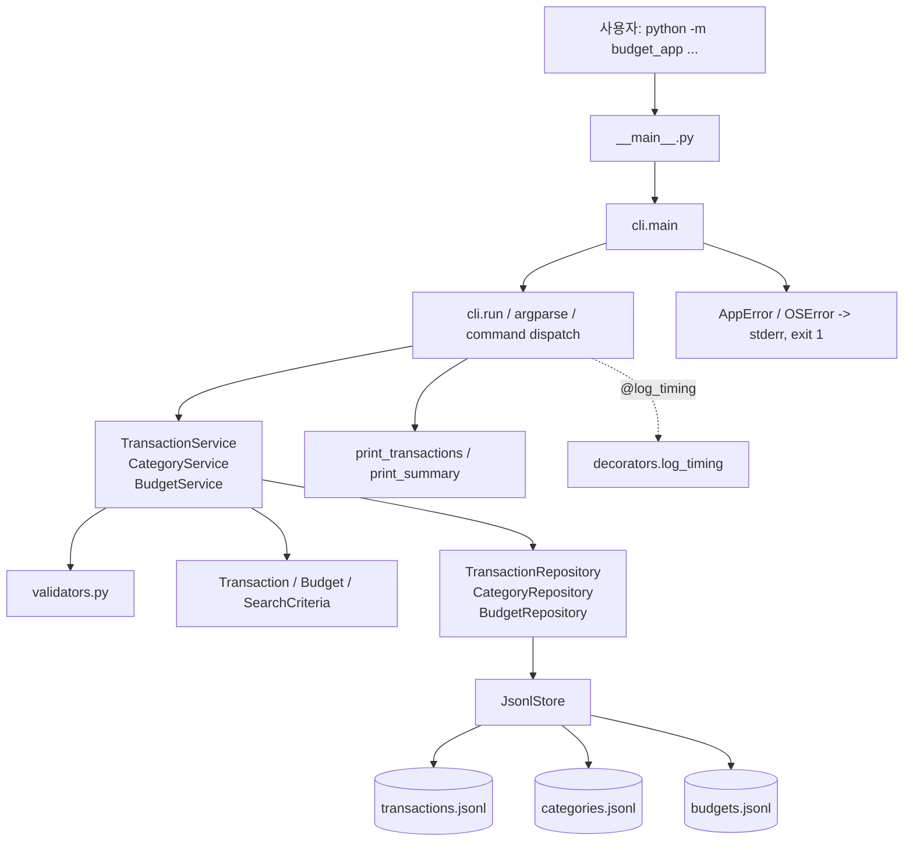
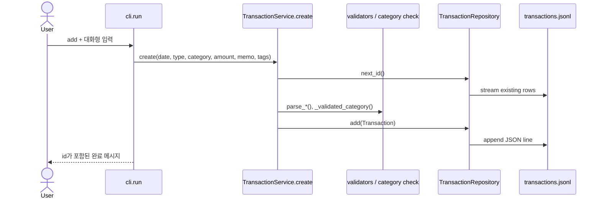
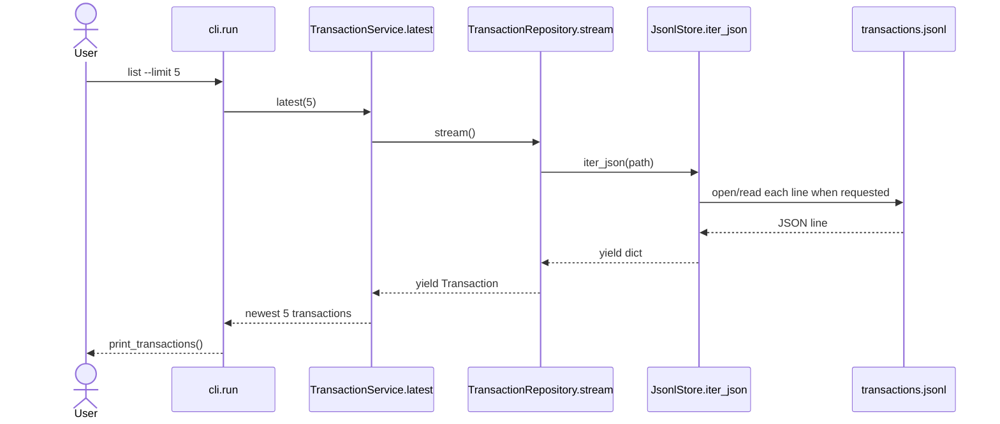
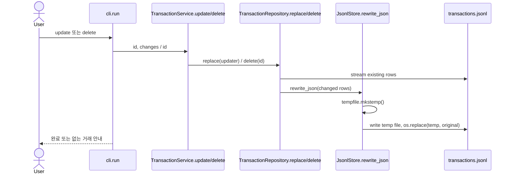
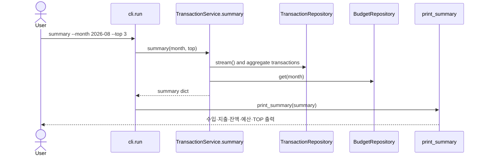

# 코드 구조와 실행 흐름 읽기 가이드

이 문서는 이 저장소의 코드를 IDE에서 직접 따라 읽기 위한 안내서입니다. 실행 방법은 [README](./README.md), Python 개념의 일반적인 설명은 [CONCEPTS](./CONCEPTS.md)를 먼저 참고하세요. 여기서는 실제 파일과 함수 이름을 기준으로 “명령 하나가 어디서 시작해 어디까지 가는가”를 추적합니다.

## 1. 가장 먼저 볼 것: 프로그램 시작점

예를 들어 다음 명령을 실행한다고 가정합니다.

```bash
python -m budget_app list --limit 5
```

실제 진입 흐름은 다음과 같습니다.

```text
python -m budget_app
  -> __main__.py: main() 호출
  -> cli.py: main()
  -> cli.py: run()  (@log_timing이 감싼 wrapper를 먼저 실행)
  -> build_parser() / parser.parse_args()
  -> build_services(args.data_dir)
  -> args.command == "list" 분기
  -> TransactionService.latest(args.limit)
  -> TransactionRepository.stream()
  -> JsonlStore.iter_json(transactions.jsonl)
  -> Transaction.from_dict()
  -> formatters.print_transactions()
```

**코드에서 직접 확인**

1. `__main__.py`를 열고 `from budget_app.cli import main` 다음 줄의 `main()`을 확인합니다.
2. `cli.py`의 `main()`에서 `run()` 호출과 `except AppError`, `except OSError`를 확인합니다.
3. 바로 위의 `run()`에서 `build_parser()`, `parse_args()`, `build_services()`와 `if args.command` 분기를 차례로 찾습니다.
4. `list` 분기에서 `transaction_service.latest(args.limit)`를 따라갑니다.

## 2. 전체 Architecture Map



### 디렉터리와 읽을 파일

```text
budget_app/
├── __main__.py       # [START] python -m 의 진입점
├── cli.py            # [CLI] parser, 입력, dispatch, 출력 연결, 종료 코드
├── models.py         # [MODEL] Transaction, Budget, SearchCriteria
├── services.py       # [BUSINESS] 검증 조합과 가계부 규칙
├── repositories.py   # [GENERATOR] [FILE I/O] JSONL 접근과 파일 교체
├── validators.py     # [VALIDATION] 날짜·월·금액·유형·태그 검증
├── errors.py         # [ERROR] 사용자용 AppError
├── decorators.py     # [DECORATOR] 실행 시간 로그
└── formatters.py     # [CLI] 목록·요약 콘솔 출력
```

## 3. 계층별 책임과 경계

### CLI — `__main__.py`, `cli.py`

**책임:** `argparse`로 명령을 해석하고, 서비스 객체를 만들고, 적절한 서비스 메서드를 호출해 결과를 출력합니다.

**하지 않는 일:** JSONL 파일을 직접 읽거나 쓰지 않고, 날짜·금액 규칙을 직접 구현하지 않습니다.

**다음 계층:** `TransactionService`, `CategoryService`, `BudgetService`.

### Service — `services.py`

**책임:** 거래 생성·검색·요약·수정 규칙을 조합합니다. `TransactionService.create()`는 날짜·유형·카테고리·금액을 검증해 `Transaction`을 만든 뒤 저장합니다. `CategoryService.remove()`는 사용 중인 카테고리를 삭제하지 못하게 합니다.

**하지 않는 일:** `Path.open()`이나 `json.loads()`를 직접 호출하지 않습니다.

**다음 계층:** 각 Repository와 `validators.py`.

### Repository / Store — `repositories.py`

**책임:** `TransactionRepository`, `CategoryRepository`, `BudgetRepository`는 각 데이터의 저장 작업을 맡고, `JsonlStore`는 경로·JSONL 읽기/쓰기·임시 파일 교체를 맡습니다.

**하지 않는 일:** 예산 초과 계산, 검색 조건 판단, 카테고리 사용 여부 같은 업무 규칙을 결정하지 않습니다.

**다음 계층:** `transactions.jsonl`, `categories.jsonl`, `budgets.jsonl`.

### Model / Validation / Error

- `models.py`: 파일의 dict와 프로그램 안의 객체를 오가는 `Transaction.to_dict()` / `Transaction.from_dict()`를 포함합니다.
- `validators.py`: `parse_date`, `parse_month`, `parse_amount`, `parse_type`, `parse_tags`가 정상 값 또는 `AppError`를 만듭니다.
- `errors.py`: `AppError(message, hint)`가 사용자에게 보일 오류와 힌트를 담습니다.

## 4. 코드 위치 색인

| 항목 | 파일 | 클래스·함수 | 누가 호출하는가 | 무엇을 호출하는가 |
| --- | --- | --- | --- | --- |
| Entry point | `__main__.py` | 모듈 수준 `main()` | Python의 `-m` 실행 | `cli.main()` |
| Parser 생성 | `cli.py` | `build_parser()` | `run()` | `argparse` parser/subparser 등록 |
| Command dispatch | `cli.py` | `run()` | `main()`의 decorator wrapper | 서비스 메서드, formatter |
| 서비스 조립 | `cli.py` | `build_services()` | `run()` | `JsonlStore.initialize()`, Repository·Service 생성 |
| 데이터 모델 | `models.py` | `Transaction`, `Budget`, `SearchCriteria` | Service·Repository | `to_dict()` / `from_dict()` |
| 거래 업무 | `services.py` | `TransactionService` | `cli.run()` | validator, Repository |
| 카테고리/예산 | `services.py` | `CategoryService`, `BudgetService` | `cli.run()` | Category/BudgetRepository |
| JSONL Store | `repositories.py` | `JsonlStore` | Repository | `Path.open`, `json`, `os.replace` |
| 거래 저장소 | `repositories.py` | `TransactionRepository` | TransactionService | Store, `Transaction` 변환 |
| Generator | `repositories.py` | `iter_json()`, `stream()` | Repository·Service의 순회 | `yield` |
| Decorator | `decorators.py` | `log_timing()` | `@log_timing`으로 `run()` 정의 시 | wrapper, logger |
| 예외/exit code | `cli.py` | `main()` | `__main__.py` | stderr 출력, `SystemExit(1)` |
| CSV | `services.py` | `import_csv()`, `export_csv()` | `cli.run()` | `csv.DictReader` / `csv.DictWriter` |

## 5. 명령별 실행 추적

모든 명령은 `cli.run()`에서 parser를 만들고 인자를 해석한 뒤, `build_services()`가 `JsonlStore`와 세 Repository·세 Service를 조립한다는 공통 단계를 가집니다. 아래에서는 그 다음의 분기를 봅니다.

### `add`

```bash
python -m budget_app add
```

```text
cli.run()
  -> prompt() 6회: date, tx_type, category, amount, memo, tags
  -> TransactionService.create(...)
     -> TransactionRepository.next_id()
        -> TransactionRepository.stream()
        -> JsonlStore.iter_json(transactions.jsonl)
     -> parse_date / parse_type / _validated_category / parse_amount / parse_tags
     -> Transaction(...) 생성
     -> TransactionRepository.add()
     -> JsonlStore.append_json(transaction.to_dict())
  -> 완료 메시지 출력
```



### `list`

```bash
python -m budget_app list --limit 5
```

```text
cli.run()
  -> TransactionService.latest(5)
     -> limit > 0 검증
     -> heapq.nlargest(5, TransactionRepository.stream(), key=(date, id))
        -> JsonlStore.iter_json(transactions.jsonl)
        -> Transaction.from_dict(row)
  -> formatters.print_transactions(transactions)
```

여기서 `latest()`의 결과는 최종적으로 `list[Transaction]`이지만, 파일을 읽는 중간 단계는 `stream()` generator입니다.



### `search`

```bash
python -m budget_app search --from 2026-08-01 --to 2026-08-31 --category food --type expense --q 점심 --tag meal
```

`cli.run()`이 여섯 옵션을 `SearchCriteria(...)`로 묶어 `TransactionService.search()`에 전달합니다. `search()`는 지정된 날짜·유형·카테고리를 먼저 검증하고, `stream()`으로 모든 거래를 순회하면서 `_matches(transaction, criteria)`가 참인 거래만 모읍니다. 그 뒤 날짜와 ID 내림차순으로 정렬해 `print_transactions()`에 전달합니다.

### `update`

```bash
python -m budget_app update --id TX-000001 --amount 20000 --memo "점심 식사"
```

`cli.run()`은 모든 변경 가능 필드를 dict로 만들고 `TransactionService.update(id, changes)`를 호출합니다. Service는 전달된 날짜·유형·카테고리·금액만 먼저 검증하고, 내부 `updater(transaction)`가 `dataclasses.replace()`로 새 `Transaction`을 만듭니다. 이후 `TransactionRepository.replace()`가 그 updater를 받아 전체 파일을 다시 씁니다.

### `delete`

```bash
python -m budget_app delete --id TX-000001
```

`TransactionService.delete()`는 `TransactionRepository.delete()`에 ID를 넘깁니다. Repository는 같은 ID의 행만 새 `rows`에서 제외하고, ID를 찾았을 때에만 `rewrite_json()`을 호출합니다.



### `summary`와 `budget set`

```bash
python -m budget_app budget set --month 2026-08 --amount 500000
python -m budget_app summary --month 2026-08 --top 3
```

`BudgetService.set()`은 `parse_month()`와 `parse_amount()`를 거쳐 `Budget`을 만든 뒤 `BudgetRepository.set()`으로 저장합니다. 같은 달 예산이 있으면 제외하고 새 행을 넣은 뒤 `rewrite_json()`합니다.

`TransactionService.summary()`는 `parse_month()`와 `top > 0`을 확인한 후 `TransactionRepository.stream()`을 끝까지 순회합니다. `date.startswith(month)`인 거래에서 수입·지출·카테고리별 지출을 계산하고, `BudgetRepository.get(month)`으로 예산을 찾습니다. `formatters.print_summary()`는 예산 객체가 있을 때 사용률과 초과 경고를 표시합니다.



### `category`

```bash
python -m budget_app category add --name shopping
python -m budget_app category list
python -m budget_app category remove --name shopping
```

`category list`는 `CategoryService.list()`에서 `CategoryRepository.list()`까지 갑니다. `category add`는 `--name`이 없을 때만 `prompt()`로 이름을 받습니다. `category remove`는 `CategoryService.remove()`가 모든 거래를 `stream()`해 해당 카테고리가 사용 중인지 먼저 검사한 뒤, 안전할 때만 Repository 삭제를 호출합니다.

### `import`와 `export`

```bash
python -m budget_app import --from import.csv
python -m budget_app export --out export.csv --month 2026-08
```

`import_csv()`는 `csv.DictReader`로 헤더에 `date`, `type`, `category`, `amount`가 있는지 검사합니다. 각 행은 별도 규칙을 복제하지 않고 `self.create(...)`에 전달합니다. `AppError`가 난 행만 `skipped`를 늘리고 다음 행을 계속 처리합니다.

`export_csv()`는 `--month` 또는 `--from`/`--to`가 있는지 확인하고, `stream()`한 거래를 조건으로 거른 뒤 `csv.DictWriter`로 `date,type,category,amount,memo,tags` 헤더와 행을 UTF-8 CSV로 씁니다.

```mermaid
sequenceDiagram
    actor User
    participant CLI as cli.run
    participant TS as TransactionService.import_csv
    participant CSV as csv.DictReader
    participant Create as TransactionService.create
    participant TR as TransactionRepository
    User->>CLI: import --from import.csv
    CLI->>TS: import_csv(path)
    TS->>CSV: read header and rows
    loop each CSV row
        TS->>Create: create(row fields)
        Create->>TR: add(valid Transaction)
    end
    CLI-->>User: imported / skipped count
```

## 6. Function Call Map

```text
main()
└── run() [실제로는 @log_timing wrapper]
    ├── build_parser() -> parser.parse_args()
    ├── build_services()
    │   └── JsonlStore.initialize()
    ├── add -> TransactionService.create()
    │   ├── TransactionRepository.next_id() -> stream() -> iter_json()
    │   ├── parse_date/type/amount/tags(), _validated_category()
    │   └── TransactionRepository.add() -> append_json()
    ├── list -> TransactionService.latest() -> stream() -> iter_json() -> Transaction.from_dict()
    ├── search -> TransactionService.search() -> _matches() + stream()
    ├── update -> TransactionService.update() -> TransactionRepository.replace() -> rewrite_json()
    ├── delete -> TransactionService.delete() -> TransactionRepository.delete() -> rewrite_json()
    ├── summary -> TransactionService.summary() -> stream() + BudgetRepository.get()
    ├── budget set -> BudgetService.set() -> BudgetRepository.set() -> rewrite_json()
    ├── category -> CategoryService -> CategoryRepository
    ├── import -> TransactionService.import_csv() -> create() -> add()
    └── export -> TransactionService.export_csv() -> stream() -> csv.DictWriter
```

## 7. Generator를 실제 코드에서 추적하기

**파일:** `repositories.py`
**함수:** `JsonlStore.iter_json(path)`와 `TransactionRepository.stream()`
**yield 위치:** 각각 `yield data`, `yield Transaction.from_dict(row)`
**누가 호출하는가:** `TransactionRepository.stream()`은 `latest`, `search`, `summary`, `next_id`, `replace`, `delete`, `CategoryService.remove`, `export_csv` 등에서 사용됩니다. `stream()`이 내부에서 `iter_json()`을 순회합니다.
**실제 파일 읽기 시작:** `iter_json()` generator가 처음 소비될 때 `with path.open("r", encoding="utf-8")`가 실행됩니다. `stream()`을 호출한 순간 파일 전체가 즉시 읽히지는 않습니다.
**한 번에 메모리에 있는 것:** 현재 JSONL의 한 줄 `dict`, 그로부터 만든 한 `Transaction`이 기본 단위입니다. 단, `search()`·`replace()`·`delete()`처럼 결과/교체 행을 모으는 함수는 별도의 list를 만듭니다.

```python
# repositories.py
def iter_json(self, path: Path) -> Iterator[dict[str, Any]]:
    ...
    for line_no, line in enumerate(file, start=1):
        ...
        yield data

def stream(self) -> Iterator[Transaction]:
    for row in self.store.iter_json(self.store.transactions_path):
        yield Transaction.from_dict(row)
```

`return transactions`처럼 모든 거래가 든 list를 반환하면, list를 완성하기 전에는 호출자가 첫 거래도 받을 수 없습니다. 이 프로젝트의 `yield`는 JSONL 행을 한 개씩 `dict`, 이어서 `Transaction`으로 넘겨 `latest()`와 `summary()` 같은 순회 기반 처리에서 파일 접근을 단계적으로 진행하게 합니다.

## 8. Decorator 실행 흐름

**파일:** `cli.py`, `decorators.py`
**적용 위치:** `cli.py`의 `@log_timing` 바로 아래 `run(argv: Optional[list[str]] = None) -> int`
**실제 함수:** `decorators.py`의 `log_timing(func)`와 내부 `wrapper(*args, **kwargs)`
**분리한 공통 관심사:** CLI 명령 실행 시간의 logging.

```text
모듈을 정의할 때: run = log_timing(run)

main()이 run()을 호출할 때
  -> wrapper() 시작
  -> time.perf_counter()로 started 기록
  -> 원래 run() 실행
  -> finally에서 경과 시간 계산
  -> logger.info("%s completed in %.2fms", func.__name__, elapsed_ms)
  -> 원래 run의 반환값 또는 예외를 그대로 유지
```

`finally`에 기록 코드가 있으므로 원래 `run()`이 예외를 내보내도 경과 시간 기록을 시도합니다. `@functools.wraps(func)`는 wrapper가 원래 `run`의 이름과 문서 정보를 보존하도록 합니다.

## 9. Transaction 데이터 생명주기

```mermaid
flowchart LR
    Input[대화형 입력 또는 CSV 행] --> Create[TransactionService.create]
    Create --> Validate[parse_* / _validated_category]
    Validate --> Model[Transaction dataclass]
    Model --> Dict[Transaction.to_dict]
    Dict --> Write[JsonlStore.append_json]
    Write --> JSONL[(transactions.jsonl)]
    JSONL --> Read[JsonlStore.iter_json]
    Read --> Raw[dict]
    Raw --> Restore[Transaction.from_dict]
    Restore --> Service[Service 결과]
    Service --> Output[print_transactions / print_summary]
```



`Transaction`은 `models.py`의 `@dataclass(frozen=True)`입니다. 수정은 필드를 직접 바꾸는 대신 `TransactionService.update()` 내부의 `dataclasses.replace()`가 새 객체를 만드는 방식입니다. `from_dict()`는 기존 JSONL의 `tags`가 문자열이면 쉼표 기준 list로 정규화하는 경로도 포함합니다.

## 10. update/delete와 파일 안전성

**파일:** `repositories.py`
**핵심 함수:** `TransactionRepository.replace()`, `TransactionRepository.delete()`, `JsonlStore.rewrite_json()`.

JSONL의 중간 한 줄을 SQL의 `UPDATE`처럼 제자리에서 안전하게 바꾸기 어렵기 때문에, 이 구현은 기존 파일을 순회하여 바뀐 전체 행 목록을 만든 뒤 새 파일로 씁니다.

1. `replace()`는 일치 ID에 `updater(transaction)`를 적용하고 나머지 거래도 `rows`에 넣습니다.
2. `delete()`는 일치 ID만 `rows`에 넣지 않습니다.
3. 실제 변경 대상이 있었을 때만 `rewrite_json(path, rows)`를 호출합니다.
4. `rewrite_json()`은 `tempfile.mkstemp(..., dir=self.data_dir)`로 같은 데이터 디렉터리에 임시 파일을 만듭니다.
5. 모든 행을 임시 파일에 쓴 뒤 `os.replace(temp_name, path)`로 원본 경로를 교체합니다.
6. 쓰기 중 예외가 나면 임시 파일 제거를 시도하고 예외를 다시 올립니다. 원본 교체 전 오류라면 기존 파일은 그대로 남습니다.

`BudgetRepository.set()`과 `CategoryRepository.remove()`도 기존 행을 바꾸는 작업이라 같은 `rewrite_json()` 경로를 사용합니다.

## 11. Type Hint를 현재 코드로 읽기

| 코드 위치 | 타입 해석 |
| --- | --- |
| `TransactionService.create(..., amount: Union[str, int], ...) -> Transaction` | CLI에서 온 문자열 또는 테스트/내부의 정수를 금액으로 받고, 성공하면 거래 객체 하나를 반환합니다. |
| `TransactionRepository.stream() -> Iterator[Transaction]` | 모든 거래 list가 아니라 거래를 하나씩 내놓는 iterator를 반환합니다. |
| `JsonlStore.iter_json(path: Path) -> Iterator[dict[str, Any]]` | `Path` 하나를 받아 JSON 객체 한 줄씩을 dict로 제공합니다. 값의 타입은 JSON 필드마다 달라 `Any`입니다. |
| `TransactionRepository.replace(transaction_id: str, updater: Callable[[Transaction], Transaction]) -> bool` | ID와 “거래 하나를 받아 새 거래 하나를 돌려주는 함수”를 받고, 대상 ID 존재 여부를 반환합니다. |
| `TransactionService.update(transaction_id: str, changes: dict[str, Optional[str]]) -> bool` | 변경 필드 dict에서 각 값은 문자열 또는 미지정 `None`이며, 대상이 있었는지 반환합니다. |
| `BudgetRepository.get(month: str) -> Optional[Budget]` | 해당 월 예산이 있으면 `Budget`, 없으면 `None`입니다. |

타입 힌트는 실행 전에 입력을 강제하지 않습니다. 이 프로젝트에서 실제 유효성 판단은 `parse_*()`와 `_validated_category()`가 하고, 타입 힌트는 함수가 기대하고 반환하는 데이터 모양을 독자에게 알려 줍니다.

## 12. 오류와 종료 코드의 경로

`parse_date()` 같은 validator나 Service/Repository는 사용자에게 알려야 할 문제에서 `AppError`를 발생시킵니다. `cli.main()`이 이를 받아 `message`와 선택적 `hint`를 표준 오류로 출력한 뒤 `SystemExit(1)`을 발생시킵니다. 파일 접근 문제는 같은 함수의 `except OSError`가 처리합니다. 예외가 없는 `run()`의 반환값은 `0`이므로 정상 종료입니다.

```text
parse_date() / TransactionService / JsonlStore
  -> AppError 또는 OSError
  -> cli.main() except
  -> stderr 출력
  -> SystemExit(1)
```

## 13. 발표·면접 대비 질문

각 질문의 답은 아래에 적은 파일·함수부터 찾아 실제 코드로 확인할 수 있습니다.

1. **왜 하나의 JSON 파일이 아니라 JSONL인가?** — `repositories.py: JsonlStore.append_json()`, `iter_json()`. 거래 추가는 한 줄 append이고, 조회는 행 단위 순회입니다.
2. **왜 generator를 사용하는가?** — `JsonlStore.iter_json()`, `TransactionRepository.stream()`, `TransactionService.latest()`. 줄과 거래를 단계적으로 전달합니다.
3. **`yield`와 `return`은 여기서 어떻게 다른가?** — 위 두 generator 함수의 `yield`와 `TransactionService.latest()`의 list 반환을 비교합니다.
4. **generator는 언제 파일을 실제로 여는가?** — `iter_json()`의 `with path.open(...)`; generator 소비가 시작될 때입니다.
5. **Repository를 분리한 이유는?** — `cli.run()`이 Repository가 아니라 Service만 호출하고, 파일 I/O가 `repositories.py`에 모여 있음을 확인합니다.
6. **Service와 Repository의 차이는?** — `TransactionService.summary()`의 합계 규칙과 `TransactionRepository.add()`의 저장 규칙을 비교합니다.
7. **Decorator는 왜 쓰는가?** — `cli.py: @log_timing`, `decorators.py: log_timing()`. 명령 로직에 timing 코드를 반복하지 않습니다.
8. **Decorator가 없으면 어떻게 되는가?** — `run()`의 전후에 `perf_counter()`와 `logger.info()`를 직접 반복해야 합니다. 현재는 wrapper가 그 일을 합니다.
9. **Type hint가 실행 전 타입을 강제하는가?** — 아니요. `validators.py: parse_amount()`가 문자열을 정수로 변환하고 검증하는 실제 지점입니다.
10. **왜 dataclass를 쓰는가?** — `models.py: Transaction`, `Budget`, `SearchCriteria`. 데이터 필드와 변환 책임을 한 모델에 둡니다.
11. **왜 update/delete는 전체 파일을 다시 쓰는가?** — `TransactionRepository.replace/delete()`. JSONL의 특정 행을 제자리에서 안전하게 편집하지 않고 새 행 집합을 만듭니다.
12. **임시 파일 교체는 무엇을 보호하는가?** — `JsonlStore.rewrite_json()`. 새 파일 완성 뒤 `os.replace()` 하므로 중간 실패에서 원본 훼손 위험을 줄입니다.
13. **import의 잘못된 행은 어떻게 되는가?** — `TransactionService.import_csv()`. 그 행은 `AppError`를 잡아 `skipped`가 되고 다음 행을 계속 읽습니다.
14. **사용 중인 category 삭제를 어떻게 막는가?** — `CategoryService.remove()`. `transactions.stream()`으로 사용 여부를 검사합니다.
15. **stack trace 대신 사용자 메시지는 어디서 만드는가?** — `cli.main()`의 `except AppError`와 `except OSError`입니다.
16. **exit code 0과 non-zero는 어디서 갈리는가?** — `run()`의 `return 0`, `main()`의 `SystemExit(1)`입니다.

## 14. 코드 읽기 연습

답을 보기 전에 해당 파일과 함수를 직접 따라가 보세요.

### Exercise 1 — `summary`

```text
python -m budget_app summary --month 2026-08
```

1. 처음 실행되는 Python 파일은 무엇인가요?
2. `summary` subcommand와 `--month`는 어디서 등록되나요?
3. 어느 Service 메서드가 호출되나요?
4. 거래 JSONL은 어느 함수가 읽나요?
5. generator가 어느 두 함수에서 이어지나요?
6. 월별 수입·지출·카테고리 합계는 어느 계층에서 계산되나요?
7. 최종 출력 함수는 무엇인가요?

### Exercise 2 — `add`

```text
python -m budget_app add
```

1. 여섯 입력 prompt의 순서와 정의 위치를 찾으세요.
2. 새 ID의 최대 번호를 찾는 함수는 무엇인가요?
3. category 존재 여부를 검사하는 메서드는 무엇인가요?
4. `Transaction`은 어느 함수에서 생성되나요?
5. JSONL에 실제 한 줄을 추가하는 함수는 무엇인가요?

### Exercise 3 — `list`

```text
python -m budget_app list --limit 5
```

1. `--limit`의 기본값과 타입은 어디서 정의되나요?
2. 전체 정렬 대신 `heapq.nlargest()`를 호출하는 이유를 코드와 함께 설명해 보세요.
3. 한 JSON line이 `Transaction`이 되는 정확한 함수 호출을 찾으세요.
4. 빈 목록일 때 어떤 formatter 분기가 실행되나요?

### Exercise 4 — `search`

```text
python -m budget_app search --category food --tag meal
```

1. CLI 옵션이 `SearchCriteria` 필드로 옮겨지는 위치를 찾으세요.
2. category의 유효성은 검색 전에 어디서 검사하나요?
3. 태그 일치 판단은 `_matches()`의 어느 조건인가요?
4. 검색 결과는 어떤 기준으로 정렬되나요?

### Exercise 5 — `update`와 `delete`

```text
python -m budget_app update --id TX-000001 --amount 20000
python -m budget_app delete --id TX-000001
```

1. update의 옵션 dict는 `cli.py` 어디에서 만들어지나요?
2. `frozen=True`인 `Transaction`을 update할 때 쓰는 함수는 무엇인가요?
3. `replace()`와 `delete()`가 공통으로 호출하는 Store 함수는 무엇인가요?
4. 임시 파일 생성과 원자적 교체 API는 무엇인가요?
5. 존재하지 않는 ID일 때 파일을 다시 쓰지 않는 조건을 찾으세요.

## 15. 추천 읽기 순서

1. **`__main__.py`** — 프로그램이 어디서 시작하는지 확인합니다.
2. **`cli.py`** — 사용자 명령이 parser와 dispatch를 통해 어느 Service 메서드로 연결되는지 봅니다.
3. **`models.py`** — 프로그램이 주고받는 `Transaction`, `Budget`, `SearchCriteria`의 모양을 먼저 익힙니다.
4. **`services.py`** — 검증·검색·집계·카테고리 규칙이 어떤 단위로 조합되는지 확인합니다.
5. **`repositories.py`** — JSONL 읽기, generator, append, 임시 파일 교체가 실제로 어떻게 구현되는지 따라갑니다.
6. **`validators.py`, `errors.py`** — 잘못된 입력이 `AppError`와 exit code 1로 바뀌는 경로를 봅니다.
7. **`decorators.py`, `formatters.py`** — 명령 공통 logging과 최종 콘솔 출력을 마지막으로 연결합니다.

이 순서로 읽으면 `python -m budget_app list --limit 5` 한 줄에서 시작해 데이터가 파일에 저장되고 다시 출력되는 흐름을 끊지 않고 추적할 수 있습니다.
