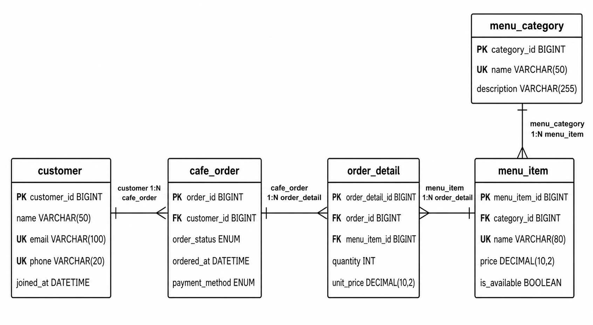
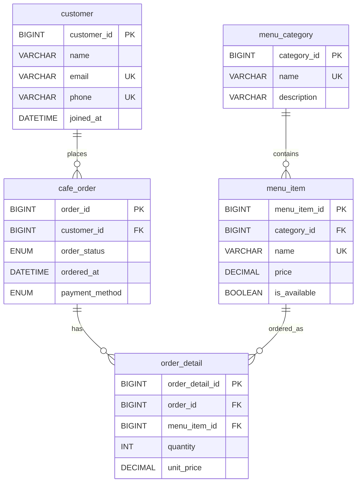

# 카페 주문 데이터베이스 실습

이 저장소는 카페 주문 데이터를 주제로 관계형 데이터베이스를 처음부터 설계하고 실행해 보는 학습 프로젝트이다. MySQL을 사용하여 데이터베이스와 테이블을 만들고, 샘플 데이터를 입력한 뒤, 조회, 조인, 집계, 서브쿼리, 수정, 삭제, 인덱스 확인까지 차례대로 실습한다.

이 문서는 실행 안내서의 역할을 한다. 데이터베이스 개념은 [DATABASE_STUDY.md](./DATABASE_STUDY.md)에서 공부하고, 스키마 해설은 [SCHEMA_GUIDE.md](./SCHEMA_GUIDE.md), 쿼리 해설은 [SQL_QUERY_GUIDE.md](./SQL_QUERY_GUIDE.md)에서 읽는다.

## 1. 이 미션에서 배우는 것

이 미션의 목표는 단순히 SQL 파일을 실행하는 데 있지 않다. 데이터를 어떤 기준으로 테이블에 나눌지, 테이블 사이의 관계를 어떻게 표현할지, 그리고 나뉜 데이터를 SQL로 어떻게 다시 읽어낼지를 익히는 데 있다.

이 프로젝트를 끝까지 따라가며 다음 내용을 익힌다.

| 학습 주제 | 익히는 내용 |
| --- | --- |
| 테이블 설계 | 왜 데이터를 하나의 큰 표에 넣지 않고 여러 테이블로 나누는가 |
| PK | 한 행을 고유하게 식별하는 값이 왜 필요한가 |
| FK | 존재하지 않는 데이터를 참조하지 못하게 막는 방법은 무엇인가 |
| 1:N 관계 | 고객과 주문, 주문과 주문 상세의 관계를 어떻게 표현하는가 |
| 제약조건 | `NOT NULL`, `UNIQUE`, `CHECK`, `FOREIGN KEY`가 어떤 실수를 막는가 |
| SQL 조회 | `SELECT`, `WHERE`, `ORDER BY`, `LIMIT`으로 필요한 데이터를 꺼내는 방법 |
| JOIN | 나누어진 테이블을 다시 연결해서 읽는 방법 |
| GROUP BY | 주문 수, 매출 합계, 평균 주문 금액 같은 지표를 계산하는 방법 |
| 서브쿼리 | 쿼리 안의 쿼리로 조건이나 임시 결과를 만드는 방법 |
| 인덱스 | 자주 검색하거나 정렬하는 컬럼을 빠르게 찾도록 돕는 방법 |
| DBMS 차이 | MySQL과 PostgreSQL의 공통점과 문법 차이를 구분하는 방법 |

## 2. 파일 구성

| 파일 | 역할 |
| --- | --- |
| `docker-compose.yml` | MySQL 8.4 컨테이너를 실행하기 위한 설정 파일이다. |
| `schema.sql` | 데이터베이스, 테이블, 제약조건을 생성한다. |
| `sample_data.sql` | 실습에 사용할 고객, 메뉴, 주문, 주문 상세 데이터를 입력한다. |
| `queries.sql` | 미션에서 확인할 핵심 SQL 쿼리를 모아 둔 파일이다. |
| `DATABASE_STUDY.md` | 관계형 데이터베이스 개념을 책처럼 정리한 학습 문서이다. |
| `SCHEMA_GUIDE.md` | `schema.sql`의 테이블, 컬럼, 제약조건, 관계를 설명한 문서이다. |
| `SQL_QUERY_GUIDE.md` | `queries.sql`의 각 쿼리를 목적, 문법, 해석 중심으로 설명한 문서이다. |

`results/` 디렉토리는 사용하지 않는다. 이 프로젝트에서는 실행 결과를 별도 파일로 보관하기보다, SQL을 직접 실행하고 화면에 나타나는 결과를 읽으며 학습하는 방식을 사용한다.

## 3. 데이터 모델 한눈에 보기

이 프로젝트는 5개의 테이블로 구성된다.

| 테이블 | 저장하는 데이터 | 예시 |
| --- | --- | --- |
| `customer` | 고객 정보 | 이름, 이메일, 전화번호, 가입일 |
| `menu_category` | 메뉴 분류 | Coffee, Dessert, Sandwich |
| `menu_item` | 실제 판매 메뉴 | Americano, Cafe Latte, Cheesecake |
| `cafe_order` | 주문 한 건의 공통 정보 | 주문 고객, 주문 상태, 주문 시각, 결제수단 |
| `order_detail` | 주문 안에 포함된 메뉴 정보 | 주문 번호, 메뉴 번호, 수량, 주문 당시 단가 |

관계는 다음과 같이 읽는다.

| 관계 | 읽는 방법 |
| --- | --- |
| `menu_category` 1:N `menu_item` | 하나의 카테고리에는 여러 메뉴가 속할 수 있다. |
| `customer` 1:N `cafe_order` | 한 고객은 여러 번 주문할 수 있다. |
| `cafe_order` 1:N `order_detail` | 하나의 주문에는 여러 메뉴가 들어갈 수 있다. |
| `menu_item` 1:N `order_detail` | 하나의 메뉴는 여러 주문 상세에 등장할 수 있다. |

ERD로 보면 다음과 같다.



아래 Mermaid 다이어그램은 이미지와 같은 관계를 코드로 표현한 것이다.



## 4. 실행 준비

이 프로젝트는 Docker로 MySQL을 실행한다. 먼저 Docker가 설치되어 있는지 확인한다.

```bash
docker --version
```

버전이 출력되면 Docker 명령을 사용할 수 있는 상태이다.

그다음 이 프로젝트 폴더로 이동한다. 이 저장소의 폴더 이름 끝에는 공백이 있으므로 터미널에서는 `B5-1_Database\ `처럼 입력될 수 있다.

```bash
cd Desktop/Codyssey_main_course/B5-1_Database\ 
```

현재 폴더에 `docker-compose.yml`, `schema.sql`, `sample_data.sql`, `queries.sql`이 있어야 한다.

```bash
ls
```

## 5. MySQL 실행하기

다음 명령으로 MySQL 컨테이너를 실행한다.

```bash
docker compose up -d
```

컨테이너가 실행되었는지 확인한다.

```bash
docker ps
```

목록에 `cafe-order-mysql`이 보이면 MySQL이 실행 중인 상태이다.

## 6. 데이터베이스 만들기

먼저 스키마를 생성한다.

```bash
docker exec -i cafe-order-mysql mysql -u root -prootpass < schema.sql
```

이 명령은 `schema.sql`을 MySQL에 전달한다. 그 결과 `cafe_order_db` 데이터베이스가 생성되고, 5개의 테이블과 제약조건이 만들어진다. 인덱스는 `queries.sql`의 15번 쿼리에서 직접 생성하고 실행 계획으로 확인한다.

터미널에 다음 경고가 보일 수 있다.

```text
mysql: [Warning] Using a password on the command line interface can be insecure.
```

이 메시지는 오류가 아니다. `-prootpass`처럼 비밀번호를 명령어에 직접 적으면 보안상 안전하지 않을 수 있다는 경고이다. 로컬 학습용 Docker 환경에서는 그대로 진행해도 된다.

## 7. 샘플 데이터 넣기

스키마가 만들어졌다면 샘플 데이터를 입력한다.

```bash
docker exec -i cafe-order-mysql mysql -u root -prootpass < sample_data.sql
```

이 파일은 고객 10명, 메뉴 카테고리 10개, 메뉴 10개, 주문 10건, 주문 상세 12건을 입력한다.

## 8. MySQL 안에서 확인하기

MySQL에 직접 접속한다.

```bash
docker exec -it cafe-order-mysql mysql -u root -p
```

비밀번호를 물어보면 다음 값을 입력한다.

```text
rootpass
```

프롬프트가 `mysql>`로 바뀌면 MySQL 안에 들어온 것이다. 이때부터 SQL 명령을 입력할 수 있다.

```sql
SHOW DATABASES;
USE cafe_order_db;
SHOW TABLES;
SELECT COUNT(*) FROM customer;
```

MySQL에서 나가려면 다음 명령 중 하나를 입력한다.

```sql
exit;
```

## 9. 테이블 하나씩 확인하기

본격적으로 `queries.sql`의 쿼리를 실행하기 전에 테이블의 전체적인 형태를 먼저 확인한다. `DESC`는 테이블의 컬럼 구조를 보여 주고, `SELECT *`는 실제로 들어 있는 데이터를 보여 준다.

먼저 고객 정보를 확인한다.

```sql
DESC customer;

SELECT *
FROM customer
ORDER BY customer_id;
```

그다음 메뉴 카테고리를 확인한다.

```sql
DESC menu_category;

SELECT *
FROM menu_category
ORDER BY category_id;
```

각 메뉴가 어떤 카테고리에 속하는지 확인한다.

```sql
DESC menu_item;

SELECT *
FROM menu_item
ORDER BY menu_item_id;
```

주문 한 건마다 어떤 고객이 주문했는지 확인한다.

```sql
DESC cafe_order;

SELECT *
FROM cafe_order
ORDER BY order_id;
```

마지막으로 주문 안에 어떤 메뉴가 몇 개씩 들어 있는지 확인한다.

```sql
DESC order_detail;

SELECT *
FROM order_detail
ORDER BY order_detail_id;
```

이 5개 테이블을 먼저 보면 `customer_id`, `category_id`, `order_id`, `menu_item_id`가 테이블 사이를 어떻게 연결하는지 감을 잡기 쉽다. 이후 JOIN 쿼리는 이 연결 컬럼을 기준으로 나뉘어 있던 데이터를 다시 붙여서 읽는 과정이다.

## 10. 쿼리 실행하기

`queries.sql`에 들어 있는 모든 쿼리를 한 번에 실행하려면 다음 명령을 사용한다.

```bash
docker exec -i cafe-order-mysql mysql -u root -prootpass --table cafe_order_db < queries.sql
```

각 쿼리의 의미를 이해하면서 공부하려면 [SQL_QUERY_GUIDE.md](./SQL_QUERY_GUIDE.md)를 함께 읽는다. 처음 공부할 때는 한 번에 모두 실행하기보다 MySQL에 접속한 뒤 쿼리를 하나씩 복사해서 실행하는 방식이 더 좋다. 결과가 왜 그렇게 나오는지 직접 확인할 수 있기 때문이다.

## 11. 다시 처음부터 실행하기

`queries.sql`에는 `UPDATE`와 `DELETE`가 들어 있다. 따라서 한 번 실행한 뒤에는 일부 데이터가 바뀐다. 처음 상태로 되돌리고 싶다면 `schema.sql`과 `sample_data.sql`을 다시 실행한다.

```bash
docker exec -i cafe-order-mysql mysql -u root -prootpass < schema.sql
docker exec -i cafe-order-mysql mysql -u root -prootpass < sample_data.sql
```

컨테이너와 저장된 데이터까지 완전히 지우고 다시 시작하려면 다음 명령을 사용한다.

```bash
docker compose down -v
docker compose up -d
```

## 12. 학습 순서

처음 공부할 때는 다음 순서가 좋다.

1. README를 따라 MySQL 컨테이너를 실행한다.
2. [SCHEMA_GUIDE.md](./SCHEMA_GUIDE.md)를 보며 `schema.sql`의 테이블과 제약조건을 확인한다.
3. `sample_data.sql`을 읽으며 어떤 데이터가 들어가는지 확인한다.
4. README의 테이블 확인 SQL로 5개 테이블의 구조와 데이터를 하나씩 살펴본다.
5. [DATABASE_STUDY.md](./DATABASE_STUDY.md)를 읽으며 PK, FK, 정규화, JOIN, GROUP BY를 공부한다.
6. [SQL_QUERY_GUIDE.md](./SQL_QUERY_GUIDE.md)를 보며 `queries.sql`을 한 쿼리씩 실행한다.
7. 마지막으로 각 테이블과 쿼리가 어떤 문제를 해결하는지 스스로 정리한다.

## 13. 한 문장으로 정리하기

이 프로젝트는 카페 주문이라는 익숙한 상황을 이용하여, 관계형 데이터베이스가 데이터를 나누어 저장하고 다시 연결해 읽는 방식을 배우는 실습이다.
