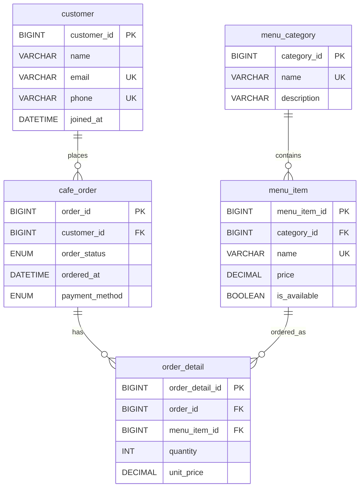

# `schema.sql` 스키마 해설서

이 문서는 `schema.sql`을 한 줄씩 읽기 위한 해설서이다. 스키마는 데이터베이스의 설계도이다. 어떤 테이블을 만들지, 각 테이블에 어떤 컬럼을 둘지, 어떤 값은 반드시 있어야 하는지, 어떤 값은 중복되면 안 되는지, 테이블끼리는 어떤 키로 연결되는지를 정한다.

데이터베이스에서 스키마를 먼저 만든 뒤 데이터를 넣는 이유는 간단하다. 데이터를 담을 그릇의 모양이 먼저 정해져야 하기 때문이다. `sample_data.sql`은 이 그릇에 데이터를 넣는 파일이고, `queries.sql`은 들어간 데이터를 읽는 파일이다.

## 1. 스키마 파일의 전체 흐름

`schema.sql`은 다음 순서로 구성된다.

```text
기존 데이터베이스 삭제
새 데이터베이스 생성
사용할 데이터베이스 선택
부모 테이블 생성
자식 테이블 생성
```

부모 테이블은 다른 테이블이 참조하는 테이블이다. 자식 테이블은 다른 테이블을 참조하는 테이블이다. 예를 들어 `customer`는 `cafe_order`가 참조하므로 부모 테이블이고, `cafe_order`는 `customer`를 참조하므로 자식 테이블이다.

외래키가 있으므로 테이블 생성 순서가 중요하다. 참조 대상이 되는 테이블이 먼저 만들어져야 한다.

스키마의 전체 관계를 ERD로 보면 다음과 같다.


아래 Mermaid 다이어그램은 이미지와 같은 관계를 코드로 표현한 것이다.



## 2. 데이터베이스 초기화

```sql
DROP DATABASE IF EXISTS cafe_order_db;
CREATE DATABASE cafe_order_db
  DEFAULT CHARACTER SET utf8mb4
  DEFAULT COLLATE utf8mb4_unicode_ci;

USE cafe_order_db;
```

`DROP DATABASE IF EXISTS cafe_order_db`는 같은 이름의 데이터베이스가 이미 있으면 삭제한다. 이 미션에서는 실습을 반복할 수 있어야 하므로 기존 데이터베이스를 지우고 처음 상태에서 다시 만들도록 했다.

`CREATE DATABASE cafe_order_db`는 새 데이터베이스를 만든다. 데이터베이스는 여러 테이블을 담는 큰 공간이다.

`DEFAULT CHARACTER SET utf8mb4`는 문자열을 저장할 때 사용할 문자 집합을 정한다. `utf8mb4`는 한글과 이모지를 포함한 다양한 문자를 저장할 수 있는 문자 집합이다.

`DEFAULT COLLATE utf8mb4_unicode_ci`는 문자열 비교와 정렬 규칙을 정한다. 예를 들어 문자열을 정렬하거나 같은 값인지 비교할 때 어떤 기준을 사용할지 결정한다.

`USE cafe_order_db`는 이후 명령을 `cafe_order_db` 데이터베이스 안에서 실행하겠다는 뜻이다.

## 3. `customer` 테이블

```sql
CREATE TABLE customer (
  customer_id BIGINT AUTO_INCREMENT PRIMARY KEY,
  name VARCHAR(50) NOT NULL,
  email VARCHAR(100) NOT NULL UNIQUE,
  phone VARCHAR(20) UNIQUE,
  joined_at DATETIME NOT NULL DEFAULT CURRENT_TIMESTAMP
) ENGINE=InnoDB;
```

`customer`는 고객 정보를 저장하는 테이블이다.

| 컬럼 | 의미 | 설계 이유 |
| --- | --- | --- |
| `customer_id` | 고객 ID | 고객 한 명을 고유하게 식별한다. |
| `name` | 고객 이름 | 고객을 표시할 때 필요한 필수 값이다. |
| `email` | 이메일 | 중복되면 안 되는 고객 식별 정보로 둔다. |
| `phone` | 전화번호 | 있을 수도 있고 없을 수도 있으므로 `NOT NULL`을 붙이지 않았다. |
| `joined_at` | 가입일 | 값을 넣지 않으면 현재 시각이 자동으로 들어간다. |

`PRIMARY KEY`는 기본키이다. `AUTO_INCREMENT`가 있으므로 새 고객이 추가될 때 `customer_id`가 자동으로 증가한다.

`email`에는 `UNIQUE`가 붙어 있다. 같은 이메일을 가진 고객이 두 명 저장되는 것을 막기 위해서이다.

`phone`도 `UNIQUE`이지만 `NOT NULL`은 아니다. 전화번호가 없는 고객은 허용하되, 전화번호가 입력된다면 다른 고객과 중복되지 않게 하는 설계이다.

`ENGINE=InnoDB`는 MySQL의 저장 엔진을 지정한다. InnoDB는 트랜잭션과 외래키를 지원하므로 관계형 데이터베이스 실습에 적합하다.

## 4. `menu_category` 테이블

```sql
CREATE TABLE menu_category (
  category_id BIGINT AUTO_INCREMENT PRIMARY KEY,
  name VARCHAR(50) NOT NULL UNIQUE,
  description VARCHAR(255)
) ENGINE=InnoDB;
```

`menu_category`는 메뉴 분류를 저장한다. 예를 들어 `Coffee`, `Dessert`, `Sandwich` 같은 값이 들어간다.

카테고리를 별도 테이블로 둔 이유는 메뉴마다 카테고리명을 문자열로 반복 저장하지 않기 위해서이다. 카테고리 이름이 바뀌어도 한 곳만 수정하면 된다.

| 컬럼 | 의미 | 설계 이유 |
| --- | --- | --- |
| `category_id` | 카테고리 ID | 카테고리 한 행을 식별한다. |
| `name` | 카테고리명 | 같은 카테고리명이 중복되지 않도록 `UNIQUE`를 둔다. |
| `description` | 설명 | 필수 값은 아니므로 `NOT NULL`을 붙이지 않았다. |

## 5. `menu_item` 테이블

```sql
CREATE TABLE menu_item (
  menu_item_id BIGINT AUTO_INCREMENT PRIMARY KEY,
  category_id BIGINT NOT NULL,
  name VARCHAR(80) NOT NULL UNIQUE,
  price DECIMAL(10, 2) NOT NULL,
  is_available BOOLEAN NOT NULL DEFAULT TRUE,
  CONSTRAINT fk_menu_item_category
    FOREIGN KEY (category_id)
    REFERENCES menu_category(category_id)
    ON UPDATE CASCADE
    ON DELETE RESTRICT,
  CONSTRAINT chk_menu_item_price
    CHECK (price > 0)
) ENGINE=InnoDB;
```

`menu_item`은 실제 판매 메뉴를 저장한다. 메뉴는 반드시 하나의 카테고리에 속하므로 `category_id`를 가진다.

| 컬럼 | 의미 | 설계 이유 |
| --- | --- | --- |
| `menu_item_id` | 메뉴 ID | 메뉴 한 개를 고유하게 식별한다. |
| `category_id` | 카테고리 ID | 이 메뉴가 어떤 카테고리에 속하는지 나타낸다. |
| `name` | 메뉴명 | 메뉴명이 중복되지 않도록 `UNIQUE`를 둔다. |
| `price` | 현재 판매 가격 | 금액이므로 `DECIMAL(10, 2)`를 사용한다. |
| `is_available` | 판매 여부 | 기본값은 판매 중인 `TRUE`이다. |

`fk_menu_item_category`는 메뉴와 카테고리를 연결하는 외래키이다. 존재하지 않는 카테고리 ID로 메뉴를 만들 수 없게 한다.

`ON UPDATE CASCADE`는 참조 중인 카테고리 ID가 바뀌면 메뉴 테이블의 `category_id`도 함께 바뀌게 한다. 실제 서비스에서는 기본키를 자주 바꾸지 않지만, 관계 동작을 명확히 보여 주기 위한 설정이다.

`ON DELETE RESTRICT`는 메뉴가 속한 카테고리를 함부로 삭제하지 못하게 한다. 어떤 메뉴가 특정 카테고리를 참조하고 있다면, 그 카테고리를 삭제했을 때 메뉴가 해석되지 않는 상태가 될 수 있기 때문이다.

`CHECK (price > 0)`는 메뉴 가격이 0보다 커야 한다는 규칙이다. 음수 가격이나 0원 메뉴가 들어오는 것을 막는다.

## 6. `cafe_order` 테이블

```sql
CREATE TABLE cafe_order (
  order_id BIGINT AUTO_INCREMENT PRIMARY KEY,
  customer_id BIGINT NOT NULL,
  order_status ENUM('ORDERED', 'PAID', 'CANCELED', 'COMPLETED') NOT NULL DEFAULT 'ORDERED',
  ordered_at DATETIME NOT NULL,
  payment_method ENUM('CARD', 'CASH', 'MOBILE') NOT NULL,
  CONSTRAINT fk_cafe_order_customer
    FOREIGN KEY (customer_id)
    REFERENCES customer(customer_id)
    ON UPDATE CASCADE
    ON DELETE RESTRICT
) ENGINE=InnoDB;
```

`cafe_order`는 주문 한 건의 공통 정보를 저장한다. 주문에 포함된 메뉴 목록은 이 테이블에 직접 넣지 않는다. 메뉴 목록은 `order_detail`에 저장한다.

| 컬럼 | 의미 | 설계 이유 |
| --- | --- | --- |
| `order_id` | 주문 ID | 주문 한 건을 고유하게 식별한다. |
| `customer_id` | 고객 ID | 어떤 고객의 주문인지 나타낸다. |
| `order_status` | 주문 상태 | 정해진 상태값 중 하나만 저장한다. |
| `ordered_at` | 주문 시각 | 주문이 발생한 시간을 저장한다. |
| `payment_method` | 결제수단 | 카드, 현금, 모바일 중 하나를 저장한다. |

`order_status`는 `ENUM`이다. 이 컬럼에는 `ORDERED`, `PAID`, `CANCELED`, `COMPLETED` 중 하나만 들어갈 수 있다. 상태값을 문자열로 아무렇게나 넣지 못하게 제한하는 효과가 있다.

`payment_method`도 `ENUM`이다. 결제수단을 `CARD`, `CASH`, `MOBILE` 중 하나로 제한한다.

`fk_cafe_order_customer`는 주문과 고객을 연결한다. 존재하지 않는 고객의 주문은 저장할 수 없다. `ON DELETE RESTRICT`가 있으므로 주문이 있는 고객은 함부로 삭제되지 않는다. 과거 주문 기록이 고객과 끊어지는 것을 막기 위한 설정이다.

## 7. `order_detail` 테이블

```sql
CREATE TABLE order_detail (
  order_detail_id BIGINT AUTO_INCREMENT PRIMARY KEY,
  order_id BIGINT NOT NULL,
  menu_item_id BIGINT NOT NULL,
  quantity INT NOT NULL,
  unit_price DECIMAL(10, 2) NOT NULL,
  CONSTRAINT fk_order_detail_order
    FOREIGN KEY (order_id)
    REFERENCES cafe_order(order_id)
    ON UPDATE CASCADE
    ON DELETE CASCADE,
  CONSTRAINT fk_order_detail_menu_item
    FOREIGN KEY (menu_item_id)
    REFERENCES menu_item(menu_item_id)
    ON UPDATE CASCADE
    ON DELETE RESTRICT,
  CONSTRAINT chk_order_detail_quantity
    CHECK (quantity > 0),
  CONSTRAINT chk_order_detail_unit_price
    CHECK (unit_price > 0)
) ENGINE=InnoDB;
```

`order_detail`은 주문에 포함된 메뉴와 수량을 저장한다. 하나의 주문에 여러 메뉴가 들어갈 수 있으므로, 주문과 주문 상세는 1:N 관계이다.

| 컬럼 | 의미 | 설계 이유 |
| --- | --- | --- |
| `order_detail_id` | 주문 상세 ID | 주문 상세 한 줄을 고유하게 식별한다. |
| `order_id` | 주문 ID | 어떤 주문에 속한 상세인지 나타낸다. |
| `menu_item_id` | 메뉴 ID | 어떤 메뉴를 주문했는지 나타낸다. |
| `quantity` | 수량 | 1개 이상이어야 한다. |
| `unit_price` | 주문 당시 단가 | 과거 주문 금액 보존을 위해 저장한다. |

`fk_order_detail_order`는 주문 상세와 주문을 연결한다. 여기에는 `ON DELETE CASCADE`가 사용된다. 주문이 삭제되면 그 주문에 속한 상세도 함께 삭제된다. 주문 상세는 주문 없이 독립적으로 의미를 가지기 어렵기 때문이다.

`fk_order_detail_menu_item`은 주문 상세와 메뉴를 연결한다. 여기에는 `ON DELETE RESTRICT`가 사용된다. 과거 주문 상세에서 사용된 메뉴가 삭제되면 주문 기록을 해석하기 어려워지므로 삭제를 제한한다.

`CHECK (quantity > 0)`는 수량이 1개 이상이어야 한다는 규칙이다. `CHECK (unit_price > 0)`는 주문 당시 단가가 0보다 커야 한다는 규칙이다.

`unit_price`는 `menu_item.price`와 비슷해 보이지만 역할이 다르다. `menu_item.price`는 현재 판매 가격이고, `order_detail.unit_price`는 주문이 발생한 순간의 가격이다. 가격 변경 이후에도 과거 매출 계산이 흔들리지 않게 하기 위해 주문 상세에 단가를 저장한다.

## 8. 인덱스는 쿼리 실습에서 생성

```sql
CREATE INDEX idx_cafe_order_ordered_at ON cafe_order(ordered_at);
```

인덱스는 특정 컬럼을 기준으로 데이터를 더 빠르게 찾기 위한 자료구조이다. 이 프로젝트에서는 `schema.sql`이 아니라 `queries.sql`의 15번 쿼리에서 주문 시각인 `ordered_at`에 인덱스를 직접 만든다.

주문 목록은 보통 최신순으로 정렬하거나 특정 기간의 주문만 조회한다. 예를 들어 “2026년 3월 4일 이후 주문”을 찾거나 “최근 주문 순서”로 정렬할 때 `ordered_at`이 자주 사용된다.

이 인덱스는 `cafe_order` 테이블에 둔다. 주문이 발생한 시각은 주문 한 건의 공통 정보이므로 `order_detail`이 아니라 `cafe_order`에 속한다. 주문 상세는 한 주문 안의 메뉴 줄을 저장하는 테이블이라서, 날짜 기준 조회의 출발점으로 삼기에는 적합하지 않다.

| 인덱스 이름 | 테이블 | 컬럼 | 쓰임 |
| --- | --- | --- | --- |
| `idx_cafe_order_ordered_at` | `cafe_order` | `ordered_at` | 기간 조건 조회와 주문 시각 정렬 |

`queries.sql`의 최신 주문 조회는 `ORDER BY ordered_at DESC`를 사용하고, 15번 인덱스 쿼리는 `CREATE INDEX`로 인덱스를 만든 뒤 `WHERE ordered_at >= '2026-03-04 00:00:00'`와 `ORDER BY ordered_at`을 함께 사용해 실행 계획을 확인한다. 두 경우 모두 주문 시각이 검색 또는 정렬 기준이므로 `ordered_at`에 인덱스를 두는 것이 자연스럽다.

반대로 모든 컬럼에 인덱스를 만들지는 않는다. `order_status`나 `payment_method`도 조회에 쓰일 수 있지만 값의 종류가 적고, 이 미션의 핵심 조회는 날짜 범위와 최신순 정렬이다. 고객명이나 메뉴명 검색을 자주 하는 요구가 생기면 그때 별도 인덱스를 검토할 수 있다.

기본키와 `UNIQUE` 제약조건이 붙은 컬럼은 MySQL이 고유성 검사와 빠른 조회를 위해 내부적으로 인덱스를 만든다. 따라서 여기서 말하는 인덱스는 `CREATE INDEX`로 직접 추가한 성능용 인덱스이며, 그 대상은 `cafe_order.ordered_at`이다.

인덱스는 조회를 빠르게 할 수 있지만 데이터를 추가, 수정, 삭제할 때 인덱스도 함께 갱신해야 한다. 따라서 모든 컬럼에 인덱스를 만드는 것이 아니라, 자주 검색하거나 정렬하는 컬럼에 선택적으로 만든다.

## 9. 스키마에서 읽어야 할 핵심

스키마를 읽을 때는 컬럼 목록만 보는 것으로 충분하지 않다. 다음 질문을 함께 던져야 한다.

| 질문 | 이 프로젝트의 답 |
| --- | --- |
| 각 테이블은 어떤 한 종류의 데이터를 담는가 | 고객, 카테고리, 메뉴, 주문, 주문 상세로 역할을 나누었다. |
| 각 테이블의 PK는 무엇인가 | 각 테이블은 `*_id` 형태의 기본키를 가진다. |
| 어떤 테이블이 다른 테이블을 참조하는가 | 주문은 고객을, 메뉴는 카테고리를, 주문 상세는 주문과 메뉴를 참조한다. |
| 필수 값은 무엇인가 | 이름, 이메일, 가격, 주문 시각, 수량 등은 `NOT NULL`이다. |
| 중복되면 안 되는 값은 무엇인가 | 이메일, 전화번호, 카테고리명, 메뉴명은 `UNIQUE`이다. |
| 값의 범위는 어떻게 제한하는가 | 가격과 수량은 `CHECK`로 0보다 크게 제한한다. |
| 삭제될 때 함께 사라질 데이터는 무엇인가 | 주문이 삭제되면 주문 상세도 함께 삭제된다. |
| 삭제되면 안 되는 부모 데이터는 무엇인가 | 주문이 있는 고객, 사용 중인 메뉴와 카테고리는 삭제를 제한한다. |

스키마는 단순한 생성 명령 모음이 아니다. 데이터의 의미와 규칙을 코드로 표현한 설계도이다.
