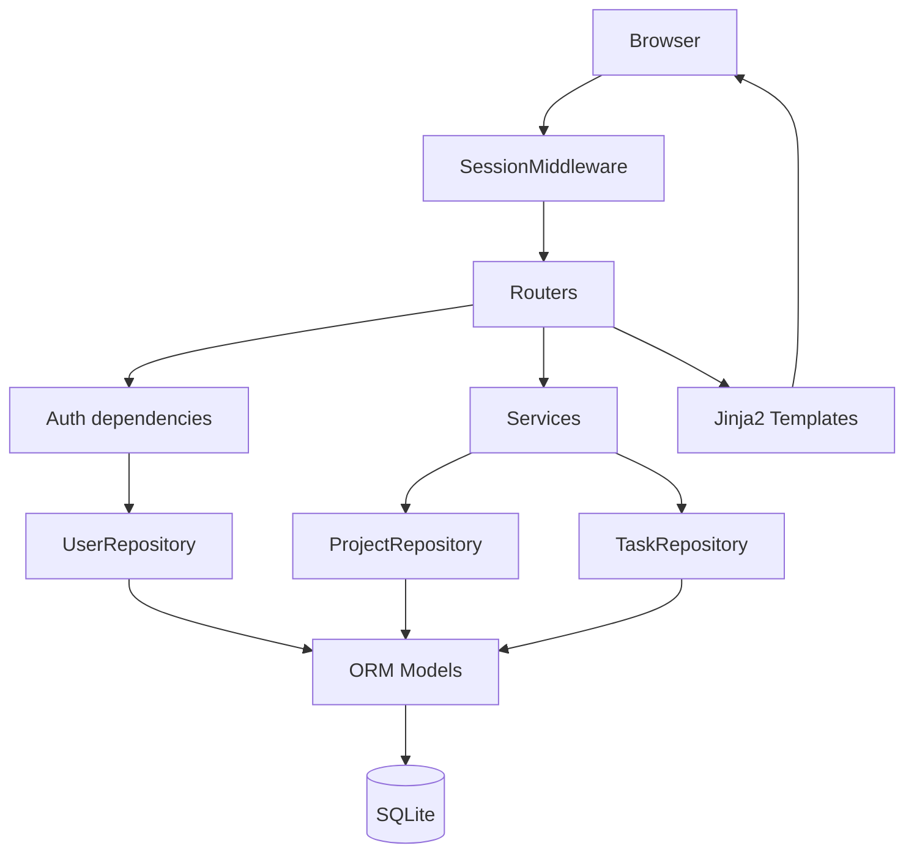
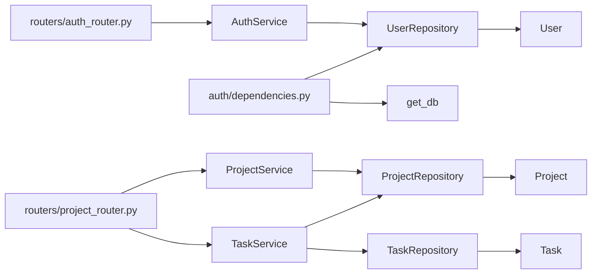
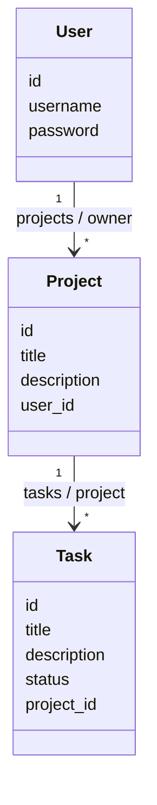
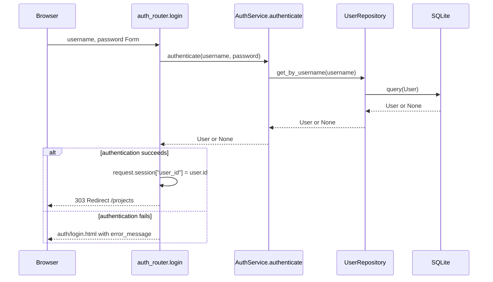
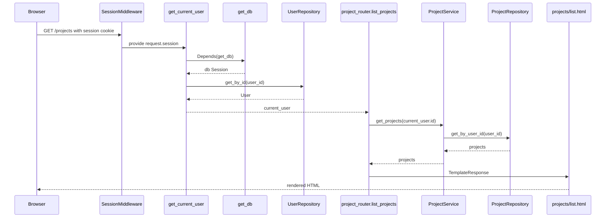
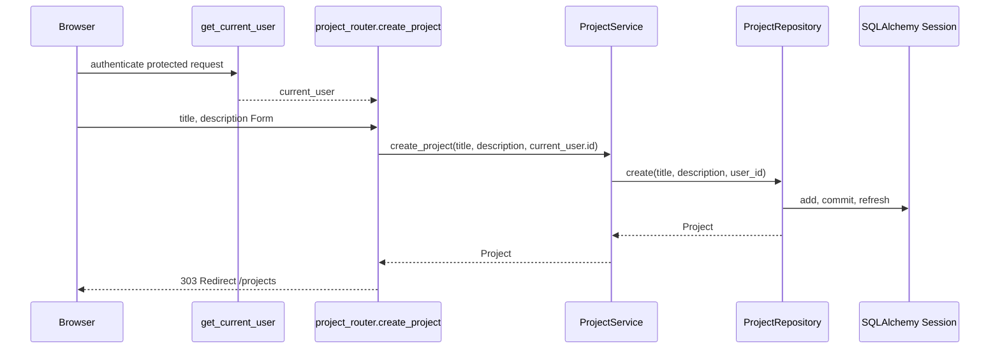
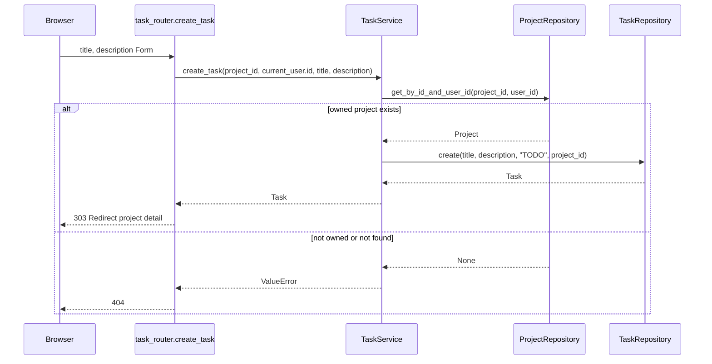
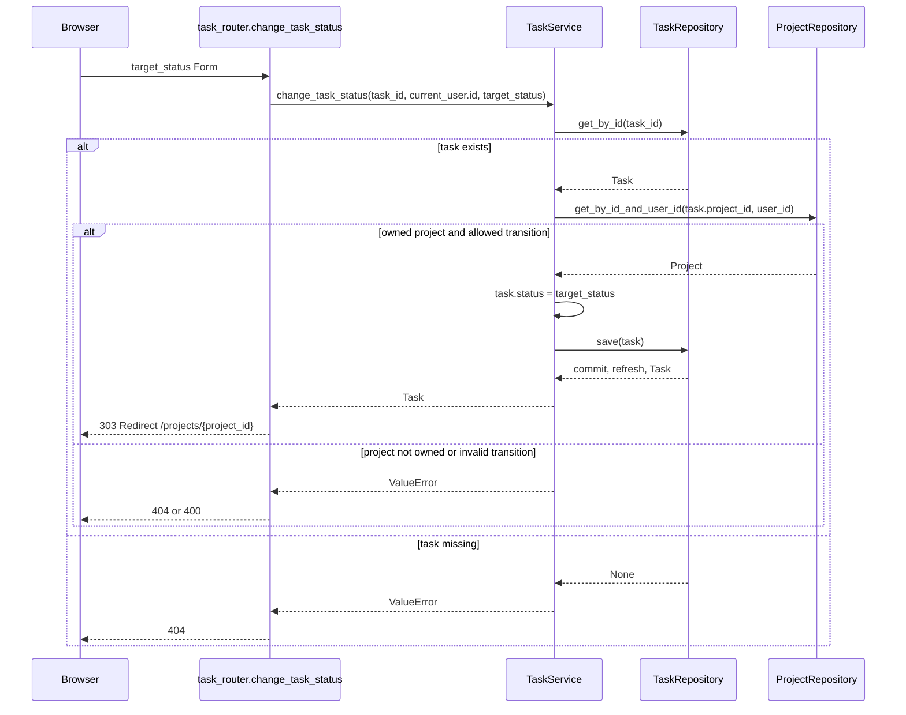

# B5-3 Code Architecture

> 실제 코드 기준 구조 및 요청 흐름 정리

이 문서는 “어느 파일의 어느 함수가 다음 파일을 어떻게 호출하는가”를 따라가기 위한 안내서입니다. 개념 자체의 설명은 [CONCEPTS.md](./CONCEPTS.md)를 참고하세요.

## 1. 전체 구조



- `main.py`가 SessionMiddleware와 세 Router를 조립합니다.
- Router는 dependency와 Service를 호출하고, 결과를 템플릿 또는 redirect로 반환합니다.
- Service는 Repository를 조합하며, Repository는 ORM Model을 통해 SQLite에 접근합니다.

## 2. 실제 디렉터리와 파일

```text
B5-3/
├─ auth/
│  ├─ __init__.py
│  ├─ bootstrap.py        # test / 1234 테스트 사용자 준비
│  ├─ config.py           # SESSION_SECRET_KEY
│  ├─ dependencies.py     # get_current_user, get_optional_current_user
│  └─ exceptions.py       # AuthenticationRequiredError
├─ models/
│  ├─ __init__.py         # 세 ORM Model import
│  ├─ user.py             # User
│  ├─ project.py          # Project, Project.tasks cascade
│  └─ task.py             # Task, status CHECK 제약
├─ repositories/
│  ├─ __init__.py
│  ├─ user_repo.py        # UserRepository
│  ├─ project_repo.py     # ProjectRepository
│  └─ task_repo.py        # TaskRepository
├─ services/
│  ├─ __init__.py
│  ├─ auth_service.py     # AuthService.authenticate
│  ├─ project_service.py  # ProjectService
│  └─ task_service.py     # TaskService
├─ routers/
│  ├─ __init__.py
│  ├─ auth_router.py      # /, /login, /logout
│  ├─ project_router.py   # /projects
│  └─ task_router.py      # Task 생성·상태 변경
├─ templates/
│  ├─ base.html
│  ├─ index.html
│  ├─ auth/login.html
│  ├─ projects/list.html
│  ├─ projects/form.html
│  ├─ projects/detail.html
│  └─ tasks/form.html
├─ database.py            # engine, SessionLocal, Base, get_db
├─ main.py                # 앱 초기화와 Router 등록
├─ templates_config.py    # 공유 Jinja2Templates 객체
├─ README.md
├─ CONCEPTS.md
└─ requirements.txt
```

## 3. 시작점: `main.py`

`uvicorn main:app --reload`는 `main.py`의 `app`을 import합니다. 이 파일의 실제 초기화 순서는 다음과 같습니다.

1. `auth.bootstrap`, `auth.config`, `database`, `models`, 세 router 모듈을 import합니다.
2. `Base.metadata.create_all(bind=engine)`로 import된 Model의 테이블을 생성합니다.
3. `ensure_test_user()`가 `test` 사용자가 없을 때만 생성합니다.
4. `app = FastAPI(...)`로 애플리케이션을 만듭니다.
5. `app.add_middleware(SessionMiddleware, ...)`를 등록합니다.
6. `AuthenticationRequiredError`를 `/login` 303 redirect로 바꾸는 `redirect_to_login()` handler를 등록합니다.
7. `auth_router.router`, `project_router.router`, `task_router.router`를 등록합니다.

개별 URL 함수는 `main.py`가 아니라 `routers/`에 있습니다.

## 4. 모듈 import / 호출 관계



`TaskService`가 `TaskRepository`뿐 아니라 `ProjectRepository`도 사용하는 이유는 Task가 속한 Project의 소유자를 확인해야 하기 때문입니다.

## 5. ORM Model 연결



| Model 파일 | DB 관계 | ORM 관계 |
| --- | --- | --- |
| `models/user.py` | `users` | `User.projects` |
| `models/project.py` | `projects.user_id → users.id` | `Project.owner`, `Project.tasks` |
| `models/task.py` | `tasks.project_id → projects.id` | `Task.project` |

`User.projects ↔ Project.owner`, `Project.tasks ↔ Task.project`는 각각 `back_populates`로 연결됩니다. `models/project.py`의 `Project.tasks`에만 `cascade="all, delete-orphan"`이 있습니다.

## 6. 로그인 요청: `POST /login`



코드를 읽는 순서는 다음과 같습니다.

```text
routers/auth_router.py: login()
  → services/auth_service.py: AuthService.authenticate()
  → repositories/user_repo.py: UserRepository.get_by_username()
  → models/user.py: User
```

## 7. 보호 페이지 요청: `GET /projects`



Session에 `user_id`가 없거나 User가 없으면 `get_current_user()`가 `AuthenticationRequiredError`를 발생시킵니다. `main.py`의 `redirect_to_login()` handler가 이를 `/login` 303 redirect로 처리하므로 `list_projects()`는 실행되지 않습니다.

## 8. Project 생성: `POST /projects`



`create_project()`는 Form에서 user_id를 받지 않습니다. Router가 인증 dependency가 반환한 `current_user.id`를 Service에 전달합니다.

## 9. Task 생성: `POST /projects/{project_id}/tasks`



`TaskService.create_task()`가 status 인자로 항상 `"TODO"`를 넘깁니다. Router는 초기 상태를 Form에서 받지 않습니다.

## 10. Task 상태 변경: `POST /tasks/{task_id}/status`



`TaskService.change_task_status()`의 `allowed_transitions`는 `TODO → IN_PROGRESS`, `IN_PROGRESS → DONE`만 허용합니다. Task가 없거나 Project 소유권이 없을 때의 `ValueError`는 같은 Router에서 404로 변환됩니다.

## 11. 인증과 인가 코드 위치

```text
Authentication
├─ auth/dependencies.py: get_current_user()
├─ auth/exceptions.py: AuthenticationRequiredError
└─ main.py: redirect_to_login()

Authorization
├─ services/project_service.py: get_project(), delete_project()
└─ services/task_service.py: _get_owned_project(), get_task(), get_tasks(), create_task(), change_task_status()
```

인증은 User 객체를 얻는 단계이고, 인가는 받은 user_id로 Project/Task의 소유 조건을 확인하는 단계입니다.

## 12. 계층별 파일 연결 표

| 영역 | 파일 | 핵심 함수 / 클래스 | 다음 호출 |
| --- | --- | --- | --- |
| Auth Router | `routers/auth_router.py` | `login()` | `AuthService.authenticate()` |
| Auth Service | `services/auth_service.py` | `AuthService.authenticate()` | `UserRepository.get_by_username()` |
| Auth Dependency | `auth/dependencies.py` | `get_current_user()` | `get_db()`, `UserRepository.get_by_id()` |
| Project Router | `routers/project_router.py` | `list_projects()`, `create_project()` | `ProjectService` |
| Project Service | `services/project_service.py` | `get_projects()`, `get_project()` | `ProjectRepository` |
| Task Router | `routers/task_router.py` | `create_task()`, `change_task_status()` | `TaskService` |
| Task Service | `services/task_service.py` | `create_task()`, `change_task_status()` | `ProjectRepository`, `TaskRepository` |
| Repository | `repositories/*.py` | `get_*()`, `create()`, `save()` | ORM Model / Session |

## 13. SQLAlchemy Session 흐름

```mermaid
flowchart TD
    Request --> GD[get_db]
    GD --> SL[SessionLocal]
    SL --> Router
    Router --> Repository
    Repository --> C[commit / refresh]
    Router --> End[request completion]
    End --> Close[finally: db.close()]
```

`database.py`의 `get_db()`는 generator입니다. `yield db`로 Router와 dependency에 같은 Session을 제공하고, 요청 처리가 끝나면 `finally`에서 닫습니다. Repository는 `SessionLocal`을 직접 만들지 않고 전달받은 `db`만 사용합니다.

## 14. Router와 Template 연결

```text
auth_router.home()                 → index.html
auth_router.login_form()/login()   → auth/login.html
project_router.list_projects()     → projects/list.html
project_router.project_form()      → projects/form.html
project_router.project_detail()    → projects/detail.html
task_router.task_form()            → tasks/form.html
```

모든 화면 템플릿은 `templates/base.html`을 상속합니다. `templates_config.py`의 단일 `templates` 객체를 모든 Router가 import합니다.

## 15. 추천 코드 읽기 순서

1. `database.py` → `models/user.py` → `models/project.py` → `models/task.py`
2. `repositories/user_repo.py` → `project_repo.py` → `task_repo.py`
3. `services/project_service.py` → `services/task_service.py`
4. `services/auth_service.py` → `auth/dependencies.py` → `auth/exceptions.py`
5. `routers/auth_router.py` → `project_router.py` → `task_router.py`
6. `templates/base.html` → 나머지 template
7. 마지막으로 `main.py`

이 순서면 DB 구조, 데이터 접근, 업무 규칙, 인증, HTTP 연결, 화면 조립 순으로 따라갈 수 있습니다.

## 16. Debug Map

```text
로그인이 실패한다
→ routers/auth_router.py: login()
→ services/auth_service.py: authenticate()
→ repositories/user_repo.py: get_by_username()

로그인했는데 /projects에 접근할 수 없다
→ auth/dependencies.py: get_current_user()
→ request.session["user_id"]
→ UserRepository.get_by_id()

Project 목록 또는 상세가 이상하다
→ services/project_service.py
→ repositories/project_repo.py
→ models/project.py

Task 상태가 바뀌지 않는다
→ routers/task_router.py: change_task_status()
→ services/task_service.py: change_task_status()
→ repositories/task_repo.py: save()
```

## 17. Mermaid 작성 원칙

이 문서의 flowchart는 계층·의존 관계, classDiagram은 ORM 모델, sequenceDiagram은 HTTP 요청 실행 순서를 보여줍니다. 모든 node와 함수명은 현재 프로젝트의 실제 파일 및 함수명을 기준으로 작성했으며, 별도 추상 계층이나 존재하지 않는 클래스를 추가하지 않았습니다.
